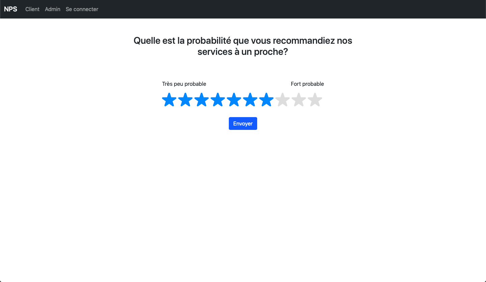

# NPS - Net Promoter Score 

This project has been mainly created for learning purpose.

The main goal of this project is to create a complete web application allowing a company, organization or group to easily measure their NPS. 
This application is written with Laravel, and currently works with SQLite. It contains a web application and an API. They both work with the same database. 

## Table of Contents

- [Technologies](#Technologies)
- [What is NPS?](#What_is_NPS?)
- [How does the web app works?](#How_does)
- [Screenshots](#Screenshots)
- [Features](#Features)
- [API](#API)
- [Setup](#Setup)

<a name="Technologies"></a>
## Technologies

- Laravel 8.x
- PHP 7.3 
- Bootstrap 5.0
- SQLite 3

<a name="What_is_NPS?"></a>
## What is NPS?

NPS stands for Net Promoter Score which is a metric used in customer experience programs. NPS measures the loyalty of customers to a company. NPS scores are measured with a single question survey and reported with a number from -100 to +100, a higher score is better.

NPS is often held up as the gold standard customer experience metric. First developed in 2003 by Bain and Company, it's now used by millions of companies to measure and track how they're perceived by their customers. 

Respondents give a rating between 0 and 10, and, depending on their response, customers fall into one of 3 categories to establish an NPS score:
- Promoters (0-6)
- Passives (7-8)
- Detractors (9-10)

<a name="How_does"></a>
## How does the web app works?

First of all, you will need to add a new client to your database. For that, connect yourself as an admin, with the following identifier: `admin@ad.com` as the email, and well, `password` for the password. 
And here you are! You can add a client then. By going on the 'client' button in the navigation bar, they can connect with their identifier and rate your company.

<a name="Screenshots"></a>
## Screenshots

Here is an app preview:

### Connexion page


### Admin page


### Form page


<a name="Features"></a>
## Features

A few of the things you can do with NPS:
- Create/Read/Delete a client from the database
- Create/Read/Update/Delete a note from the database
- Authentication system

<a name="API"></a>
## API

The documentation can be found at `/api/documentation` after launching the app.

<a name="Setup"></a>
## Setup

### Direct installation

From your command line:
```bash
git clone https://github.com/emmamange/nps-app
cd nps-app 
composer install
touch database/database.sqlite
cp .env.example .env
php artisan migrate:refresh --seed
php artisan key:generate
php artisan serve
```

### Installation step by step

Clone this repository
```bash
git clone https://github.com/Liae374/nps-app
```

Go to the repository
```bash
cd nps-app 
```

Install dependencies
```bash
composer install
```

Create the SQLite database
```bash
touch database/database.sqlite
```

Copy the .env file
```bash
cp .env.example .env
```

Create tables in the database
```bash
php artisan migrate:refresh --seed
```

Generate the application key
```bash
php artisan key:generate
```

And start the application!
```bash
php artisan serve
```
